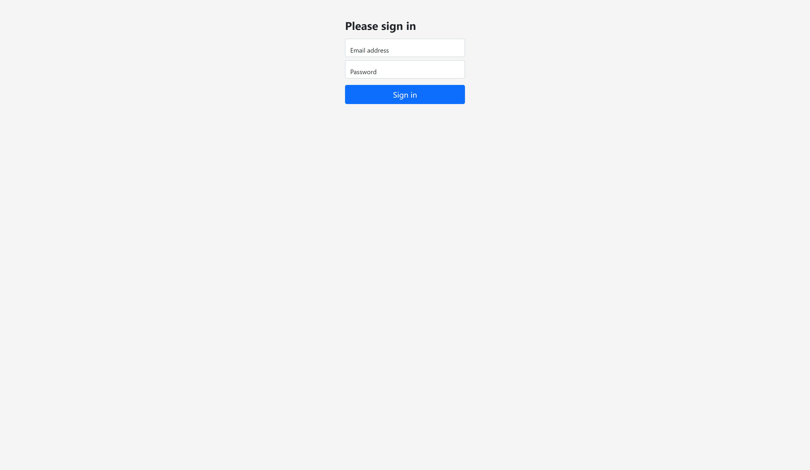
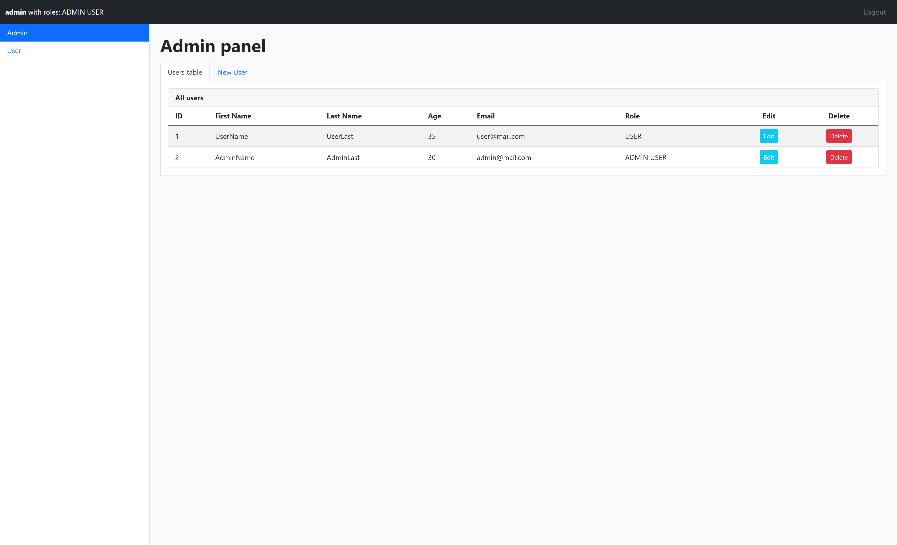
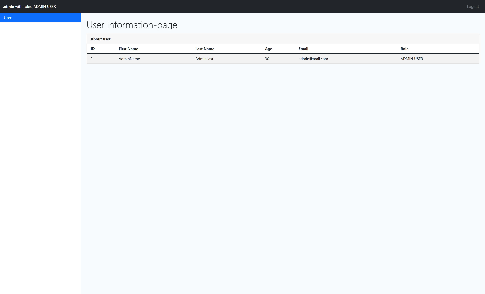
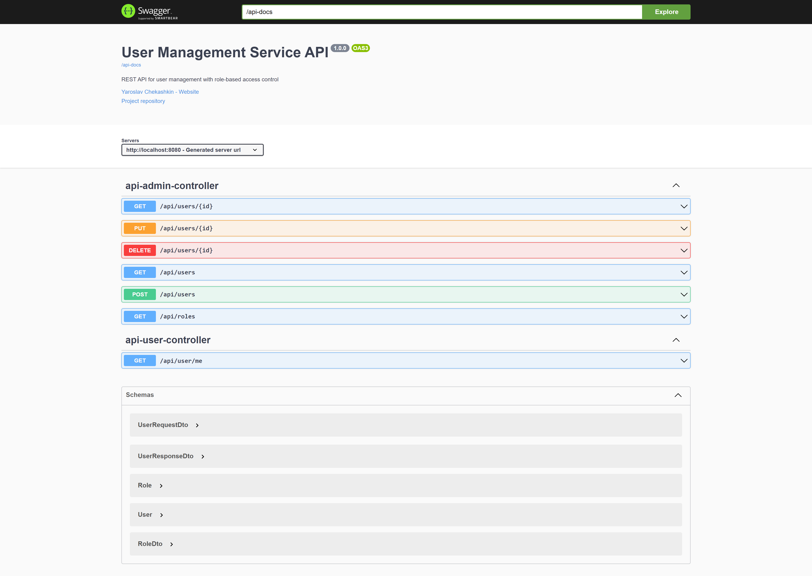

# User Management Service

[](https://github.com/Jarikjarik/user-management-service/actions/workflows/ci.yml)


Spring Boot application for user management with role-based access control. The project combines MVC pages for user interaction, a REST API for CRUD operations, Spring Security for authentication and authorization, and PostgreSQL schema management through Flyway.

## Why This Project

This repository is not just a basic CRUD demo. It shows how to build and maintain a small but structured backend application with:

- layered architecture and separation of concerns
- role-based access for `ADMIN` and `USER`
- both MVC and REST flows in one service
- PostgreSQL migration from legacy schema initialization to Flyway-managed migrations
- API documentation through Swagger UI
- local development support through Docker Compose and CI

## Key Highlights

- implemented secure login flow with Spring Security and BCrypt password hashing
- separated domain entities from API contracts through DTOs and mapper layer
- added admin user management flow with create, update, and delete operations
- exposed REST endpoints for users and roles alongside Thymeleaf-based pages
- switched database management to PostgreSQL + Flyway and moved Hibernate to validation mode
- documented the API with OpenAPI / Swagger UI

## Tech Stack

- Java 17+
- Spring Boot 2.6
- Spring Security
- Spring MVC + Thymeleaf
- Spring Data JPA
- PostgreSQL
- Flyway
- OpenAPI / Swagger UI
- Maven
- Docker Compose

## Architecture

Application flow:

`Controller -> Service -> Repository -> PostgreSQL`

Package layout:

```text
src/main/java/com/jarik/usermanagement
|-- config
|-- controller
|   `-- api
|-- dto
|   `-- api
|-- mapper
|-- model
|-- repository
`-- service
```

### Main Design Decisions

- `MVC + REST together`: the project demonstrates both server-side rendered pages and JSON API endpoints inside one application
- `DTO + mapper layer`: REST models are separated from JPA entities to keep API contracts explicit
- `Flyway for schema control`: database structure is versioned through migrations instead of `ddl-auto=update`
- `Role-based authorization`: different user journeys are enforced through Spring Security route rules

## Features

- form-based login at `/login`
- admin panel for managing users
- personal user page for authenticated users
- REST API for user CRUD operations
- role lookup endpoint
- current authenticated user endpoint
- Swagger UI for API exploration
- Docker Compose setup for local PostgreSQL

## Security

- authentication with Spring Security
- password storage with BCrypt hashes
- route protection for admin and user areas
- CSRF support on form login
- role-based access control for `ADMIN` and `USER`

## UI Preview

### Login Page



### Admin Panel



### User Page



### Swagger UI



## Endpoints

### MVC

- `GET /login`
- `GET /user`
- `GET /admin`

### REST

- `GET /api/roles`
- `GET /api/users`
- `GET /api/users/{id}`
- `POST /api/users`
- `PUT /api/users/{id}`
- `DELETE /api/users/{id}`
- `GET /api/user/me`

## Example API Flow

Create a user:

```bash
curl -X POST http://localhost:8080/api/users \
  -H "Content-Type: application/json" \
  -d '{
    "name": "John",
    "lastName": "Doe",
    "age": 28,
    "email": "john.doe@mail.com",
    "username": "johndoe",
    "password": "secret",
    "rolesIds": [1]
  }'
```

Get all users:

```bash
curl http://localhost:8080/api/users
```

## Database and Migrations

Flyway migration files:

- `V1__init_schema.sql` creates schema and tables
- `V2__insert_default_users.sql` inserts default roles and users

Hibernate does not generate or update the schema automatically. It only validates entity mappings against the migrated database.

## Default Accounts

- `admin / admin`
- `user / user`

## Running Locally

### Prerequisites

- Java 17+
- PostgreSQL or Docker Compose
- Maven Wrapper

### Option 1. Run with local PostgreSQL

Application datasource is configured in `src/main/resources/application.properties`:

```properties
spring.datasource.url=jdbc:postgresql://localhost:5432/user_management
spring.datasource.username=app_user
spring.datasource.password=12345
```

Create the database:

```sql
CREATE DATABASE user_management;
```

Run the application:

```bash
./mvnw spring-boot:run
```

Windows:

```bash
mvnw.cmd spring-boot:run
```

### Option 2. Run with Docker Compose

Start PostgreSQL:

```bash
docker compose up -d
```

If you previously started PostgreSQL with different credentials, recreate the volume once:

```bash
docker compose down -v
docker compose up -d
```

Container credentials:

- database: `user_management`
- username: `app_user`
- password: `12345`

## Local URLs

- Application: [http://localhost:8080](http://localhost:8080)
- Swagger UI: [http://localhost:8080/swagger-ui](http://localhost:8080/swagger-ui)
- OpenAPI docs: [http://localhost:8080/api-docs](http://localhost:8080/api-docs)

## Project Structure

```text
user-management-service/
|-- .github/workflows/ci.yml
|-- docs/screenshots/
|-- src/
|   |-- main/
|   |   |-- java/com/jarik/usermanagement/
|   |   `-- resources/
|   |       |-- application.properties
|   |       |-- db/migration/
|   |       |-- static/js/
|   |       `-- templates/
|   `-- test/
|-- docker-compose.yml
|-- pom.xml
|-- mvnw
|-- mvnw.cmd
`-- README.md
```

## Testing

Run tests:

```bash
./mvnw test
```

Windows:

```bash
mvnw.cmd test
```

CI workflow is configured in `.github/workflows/ci.yml`.

## Future Improvements

- integration tests with Testcontainers
- pagination and filtering for user list
- improved validation and error handling
- deployment configuration for a public demo environment

## Author

Yaroslav Chekashkin

- GitHub: [@Jarikjarik](https://github.com/Jarikjarik)
- Repository: [user-management-service](https://github.com/Jarikjarik/user-management-service)
